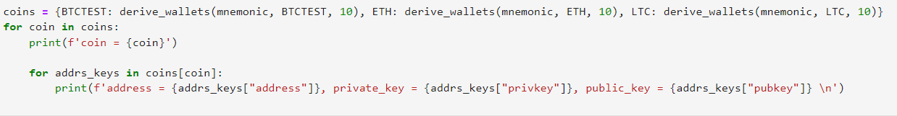
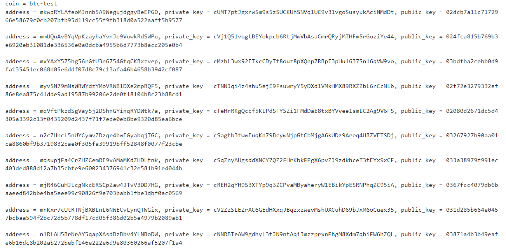
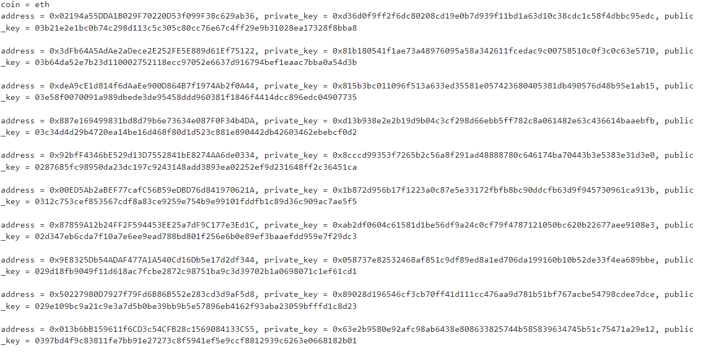
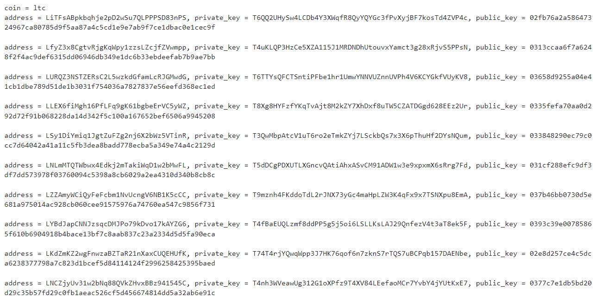
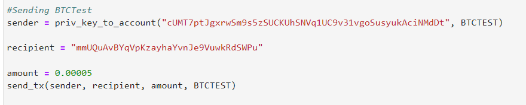
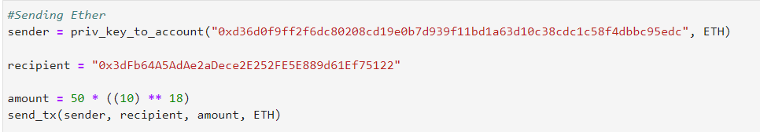

# Wallet for Bitcoin and Ethereum

### Descirption
This wallet helps with transfer of bitcoin or ethereum from one address to another. This is built with HD Wallet tool which would result to deterministic accounts based on the mnemonic provided. 

### How to use

1. Please refer to requirements.txt file for installing some of the dependencies

2. Call derive_wallets() function with appropriate parameters as below to generate the public/private keys based on mnemonic:
   
   
   
   Below is the snapshot of keys generated for different coins like BTC-Test, ETH and LTC
   
   
   
   
   
3. In order to send test bitcoin, will have to call send_tx function with appropriate parameter values. Below is the snapshot of an example:

  

   Below is the snapshot of the resulting transaction out of this

  

4. In order to send ethereum, will have to call send_tx function with appropriate parameter values. Below is the snapshot of an example:

  

   Below is the snapshot of the resulting transaction out of this

  

